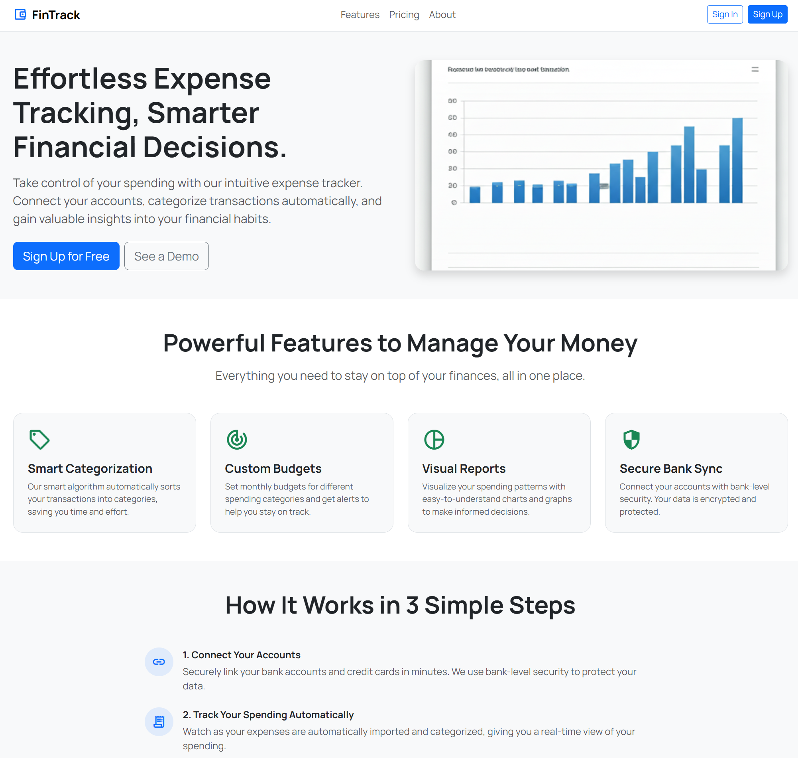

# Personal Expense Tracker

A Flask web app for capturing personal expenses, setting monthly budgets, and visualizing spending by category.

## Live Demo
- https://personal-expences-tracker-steel.vercel.app/

## Screenshot
- 

## Highlights
- Secure signup/signin with CSRF-protected forms and hashed passwords
- Add, edit, and delete expenses with category, date, and description
- Monthly budget tracking with remaining balance indicators
- Dashboard with category summaries and recent expenses
- Chart.js charts for spend/budget visualizations
- Responsive UI using Bootstrap 5 and custom styling

## Tech Stack
- Python (Flask, SQLAlchemy, WTForms, Werkzeug)
- SQLite (default) via SQLAlchemy ORM
- Jinja2 templates, Bootstrap 5, Chart.js, custom CSS, Material Symbols

## Requirements
- Python 3.10+ (with `pip`)
- SQLite (bundled with Python on most platforms)

## Quick Start
1. Create a virtual environment and activate it  
   - Windows: `python -m venv venv && venv\\Scripts\\activate`  
   - macOS/Linux: `python -m venv venv && source venv/bin/activate`
2. Install dependencies: `pip install -r requirements.txt`
3. (Optional) Export a secret for session/CSRF: `set SECRET_KEY=your-secret` (Windows) or `export SECRET_KEY=your-secret` (macOS/Linux)
4. Run the app (creates `site.db` on first run):  
   - `python app.py`  
   - or `flask --app app run` (use `--debug` during development)

## Configuration
- `SECRET_KEY`: session and CSRF protection; defaults to `dev-secret-key` if not set.
- `SQLALCHEMY_DATABASE_URI`: set in `app.py` (`sqlite:///site.db` by default). Update to point to another SQLite path or a different database engine if needed.
- `SQLALCHEMY_TRACK_MODIFICATIONS`: disabled by default.

## Project Structure
- `app.py` — Flask application, routes, forms, and CLI entry point
- `models/` — SQLAlchemy models and DB setup
- `templates/` — Jinja2 templates for pages and partials
- `static/` — CSS and assets
- `instance/` — runtime artifacts (leave `.env`/DB here if you prefer)
- `requirements.txt` — Python dependencies

## Development Tips
- Database is created automatically on first run; delete `site.db` to start fresh (you will lose data).
- Use `flask --app app --debug run` for auto-reload during development.
- If `flask` is not recognized, ensure your virtual environment is active and Flask is installed in it.

## Scope and Notes
- Intended for individual expense tracking (no multi-tenant/team features).
- No payment processing or bank integrations included.
- Auth is session-based; ensure `SECRET_KEY` is set in production.
